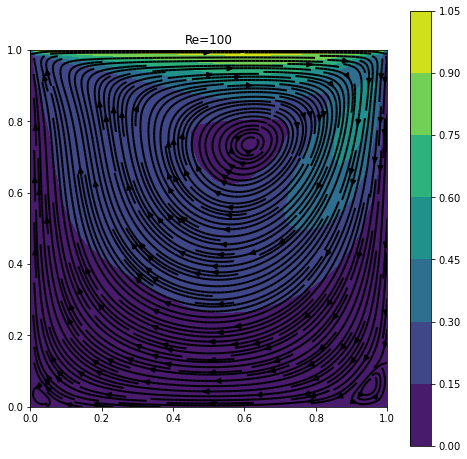
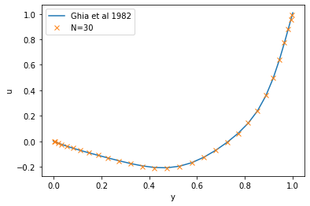
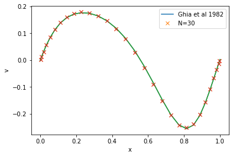
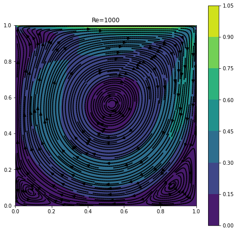
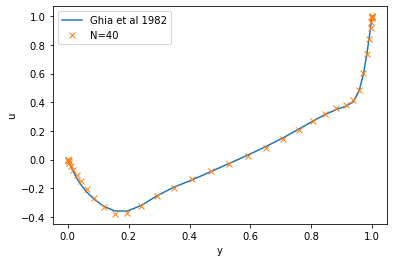
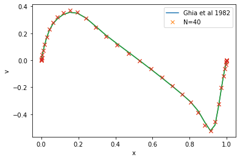
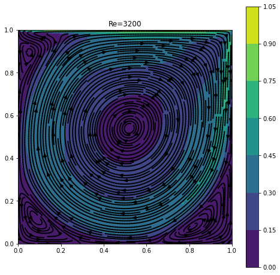
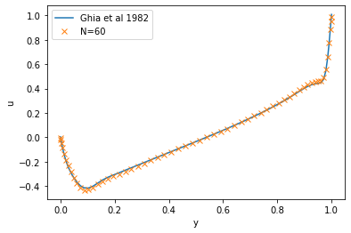
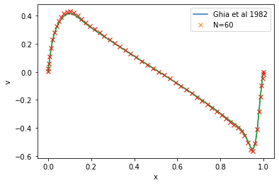
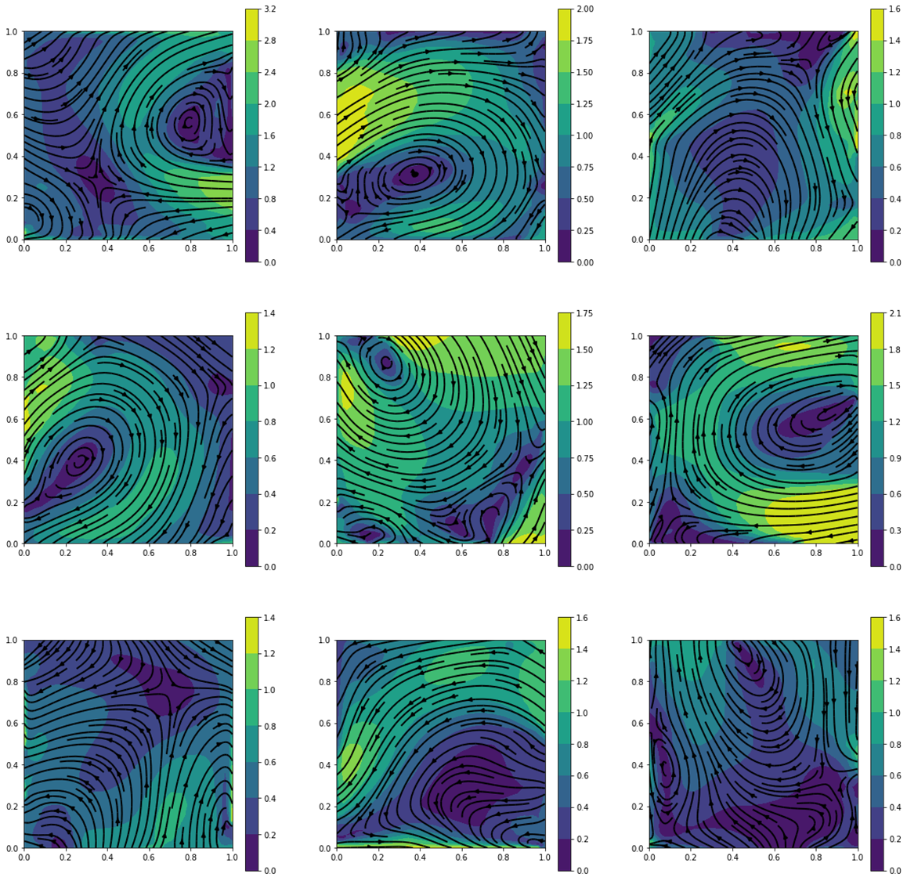

# Python fluid solver for square geometry
This project is a implementation of the SIMPLE (Semi-Implicit Method for Pressure Linked Equations) algorithm for solving incompressible fluid dynamics on a square rectangular geometry. The algorithm uses finite volume and UDS (upstream differencing scheme) and allows for CDS (central difference scheme correction). The mesh is a grid of rectangular control volumes and can be defined to have custom size along the two directions. The code is commeted and I am hopping it will be used who are interesed to learn more about CFD algorithms from an example.
# Lid driven cavity flow benchmark example
The algorithm was used to solve the lid driven cavity flow and the results were compared with the benchmark data extracted from paper: Ghia et al (1982) JCP 48:387-411. The problem was solver for Reynolds numbers: 100,1000,3200

  
  
  

  
  
  

  
  
  

# Code structure
solverFunctions.py - functions and classes used in the solver
analysisFunction.py - functions and classes used in the analysis and visualisation of the solving process
lid_driven_cavity_flow.py - lid driven cavity flow solved and compared with literature data
main.py - solves a problem with random boundary condition
parallel.py - generates large amounts of random solutions with multiprocessing
# Random solution generation
This solver was developed as a part of a project using a neural networks (variation auto-encoders) to find non-linear eigensolutions of navier-stokes equations for fixed geometry. This requires a large dataset of solved fluid problems with random boundary conditions. Example of solutions is shown bellow:

  

